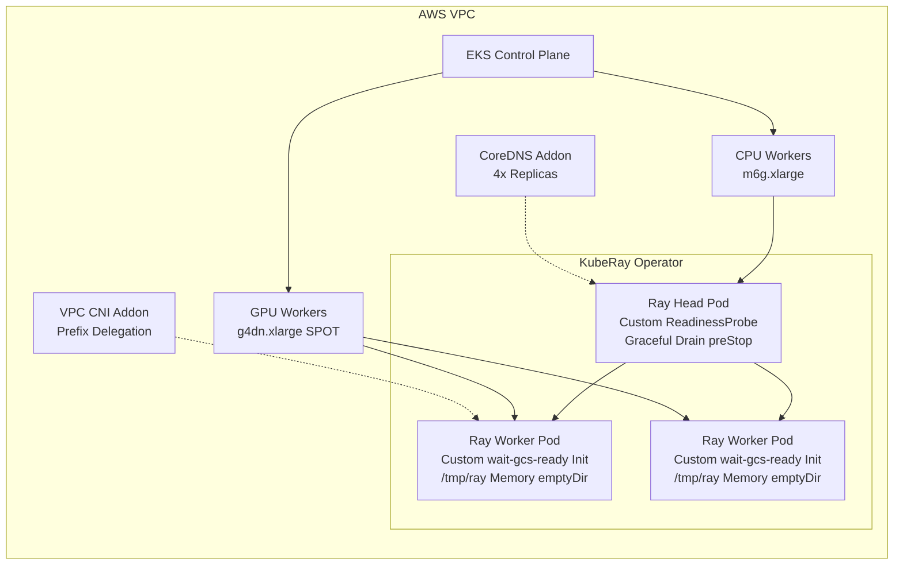

# Terraform Module: Ray on Kubernetes (EKS)

[](https://github.com/ambicuity/Terraform-Driven-Ray-on-Kubernetes-Platform/actions/workflows/terraform-ci.yml)
[](https://github.com/ambicuity/Terraform-Driven-Ray-on-Kubernetes-Platform/actions/workflows/tfsec.yml)
[](https://github.com/ambicuity/Terraform-Driven-Ray-on-Kubernetes-Platform/actions/workflows/tflint.yml)
[](https://github.com/ambicuity/Terraform-Driven-Ray-on-Kubernetes-Platform/actions/workflows/checkov.yml)
[](https://github.com/ambicuity/Terraform-Driven-Ray-on-Kubernetes-Platform/actions/workflows/kube-score.yml)
[](https://github.com/ambicuity/Terraform-Driven-Ray-on-Kubernetes-Platform/actions/workflows/codeql.yml)
[](https://github.com/ambicuity/Terraform-Driven-Ray-on-Kubernetes-Platform/actions/workflows/python-lint.yml)
[](https://opensource.org/licenses/MIT)

A production-grade Terraform module for provisioning a robust, autoscaling Kubernetes (EKS) cluster optimized specifically for Ray ML workloads. 

Unlike generic EKS blueprints, this repository is engineered to solve the **"Legendary Problems"** that cause distributed Ray environments to fail violently at scale.

## Battle-Hardened Architecture

This module implements specific, architectural fixes for the most notorious Ray-on-Kubernetes failure modes:

1. **The HA Head Node Failover (502 Prevention)**: Injected `preStop` graceful drains and `ray health-check` custom readiness probes to eliminate the 502 Bad Gateway errors that plague KubeRay during Spot interruptions.
2. **The `wait-gcs-ready` OOM Loop**: Overrode the default KubeRay Python init-container (which consumes 180MB+ RAM) with a lightweight native socket-check `python:3.10-slim` image, eliminating `OOMKilled` loops on memory-constrained nodes.
3. **The "DiskPressure" Node Eviction Loop**: Implemented `emptyDir` mounts with `medium: Memory` for the `/tmp/ray` object spilling directory on GPU workers. This isolates Ray's spillage from the Kubernetes Kubelet root filesystem, optimizing performance to RAM-speed and preventing catastrophic node evictions.
4. **GPU ENI IP Exhaustion**: Configured the AWS VPC CNI with `ENABLE_PREFIX_DELEGATION="true"`. This multiplies the pod density capacity per EC2 instance by 16x, ensuring Ray worker sidecars don't exhaust the network interface limits on instances like `g4dn.xlarge`.
5. **CoreDNS Scale-Up Storms**: Scaled the CoreDNS EKS Addon to 4 high-capacity replicas. When 100+ Ray workers auto-scale simultaneously, they no longer DDoS the cluster DNS trying to resolve the Head node.
6. **Perpetual Terraform OIDC Drift**: Decoupled the `aws_iam_openid_connect_provider` into managed and unmanaged states, arresting the perpetual `terraform plan` drift caused by the AWS API's native thumbprint fetching.
7. **Strict Security Governance**: Open Policy Agent (OPA) represents ~19% of this codebase, actively enforcing network policies, IAM boundaries, and pod security standards before deployment.
8. **Aggressive GPU FinOps**: GPU nodes default to **SPOT** capacity. Ray's built-in object store fault tolerance combined with custom `preStop` drains makes this inherently resilient to EC2 Spot interruptions.



## Quick Start Configuration

Deploy the core EKS engine and the natively-integrated Helm addons using a minimal `module` block:

```hcl
module "ray_eks_cluster" {
  source = "github.com/ambicuity/Terraform-Driven-Ray-on-Kubernetes-Platform//terraform"

  cluster_name = "production-ray-cluster"
  region       = "us-east-1"
  
  # Network Configuration (Bring Your Own VPC)
  vpc_id     = "vpc-0abcd1234efgh5678"
  subnet_ids = ["subnet-0123456789abcdef0", "subnet-0123456789abcdef1"]

  # Worker Configurations
  cpu_node_min_size     = 2
  cpu_node_max_size     = 10
  
  enable_gpu_nodes      = true
  gpu_capacity_type     = "SPOT"
  gpu_node_max_size     = 5
  
  # Feature Toggles
  enable_velero                     = true
  enable_oidc_thumbprint_management = false
}
```

## Operational Excellence

### Real-World Resilience Testing
This platform is not just theoretically robust—it includes an executable validation suite to empirically prove its mitigations against the legendary failure modes on your own live EKS cluster.

See the [Validation Runbook](validation/README.md) to execute the following test scripts:
- **MTTR & HA Validation:** `workloads/ha_resilience_test.py` validates the preStop hook, proving 0% error rate during Head node failure.
- **200-Node Scale Event:** `validation/test_scale_event.sh` triggers a massive autoscaling event and monitors the CoreDNS scaling fix.
- **GPU Pod Density Fix:** `validation/test_gpu_density.sh` queries the AWS CNI dynamically to prove `g4dn.xlarge` instances have a capacity of 110+ pods via Prefix Delegation.
- **Memory Stress Object Spilling:** `validation/test_memory_spill.py` forces object store exhaustion to prove safe spillage to the `/tmp/ray` memory-backed `emptyDir` without triggering Kubelet `DiskPressure`.

### Automated Native Backups
Full Velero integration provides pod volume backups and Kubernetes state snapshots. This includes native KMS encryption and IAM Roles for Service Accounts (IRSA) injection perfectly scoped with `kms:Decrypt` and `kms:GenerateDataKey`.

---

## Technical Documentation

Deep technical reference material is located in the `docs/` directory:

- [Architecture Reference](docs/architecture.md)
- [Terraform Module Reference](docs/terraform-module.md)
- [AI Automation Guide](docs/ai-automation.md)
- [CI/CD Pipeline Catalog](docs/ci-cd-pipelines.md)
- [Security & Compliance](docs/security.md)
- [Multi-layer Autoscaling](docs/autoscaling.md)
- [Operations & Troubleshooting](docs/operations-guide.md)
- [Contributor Guide](docs/contributing.md)

<details>
<summary><b>Terraform Provider & Resource Reference (Click to expand)</b></summary>

<!-- BEGIN_TF_DOCS -->
## Requirements

| Name | Version |
|------|---------|
| <a name="requirement_terraform"></a> [terraform](#requirement\_terraform) | >= 1.6.0 |
| <a name="requirement_aws"></a> [aws](#requirement\_aws) | >= 5.0 |
| <a name="requirement_kubernetes"></a> [kubernetes](#requirement\_kubernetes) | >= 2.0 |
| <a name="requirement_tls"></a> [tls](#requirement\_tls) | >= 4.0 |

## Providers

| Name | Version |
|------|---------|
| <a name="provider_aws"></a> [aws](#provider\_aws) | >= 5.0 |
| <a name="provider_tls"></a> [tls](#provider\_tls) | >= 4.0 |

## Modules

No modules.

## Resources

| Name | Type |
|------|------|
| [aws_cloudwatch_log_group.cluster](https://registry.terraform.io/providers/hashicorp/aws/latest/docs/resources/cloudwatch_log_group) | resource |
| [aws_eks_addon.addons](https://registry.terraform.io/providers/hashicorp/aws/latest/docs/resources/eks_addon) | resource |
| [aws_eks_cluster.main](https://registry.terraform.io/providers/hashicorp/aws/latest/docs/resources/eks_cluster) | resource |
| [aws_eks_node_group.cpu_workers](https://registry.terraform.io/providers/hashicorp/aws/latest/docs/resources/eks_node_group) | resource |
| [aws_eks_node_group.gpu_workers](https://registry.terraform.io/providers/hashicorp/aws/latest/docs/resources/eks_node_group) | resource |
| [aws_iam_openid_connect_provider.cluster](https://registry.terraform.io/providers/hashicorp/aws/latest/docs/resources/iam_openid_connect_provider) | resource |
| [aws_iam_policy.cluster_autoscaler](https://registry.terraform.io/providers/hashicorp/aws/latest/docs/resources/iam_policy) | resource |
| [aws_iam_policy.ebs_csi](https://registry.terraform.io/providers/hashicorp/aws/latest/docs/resources/iam_policy) | resource |
| [aws_iam_role.cluster](https://registry.terraform.io/providers/hashicorp/aws/latest/docs/resources/iam_role) | resource |
| [aws_iam_role.cluster_autoscaler](https://registry.terraform.io/providers/hashicorp/aws/latest/docs/resources/iam_role) | resource |
| [aws_iam_role.node](https://registry.terraform.io/providers/hashicorp/aws/latest/docs/resources/iam_role) | resource |
| [aws_iam_role.node_termination_handler](https://registry.terraform.io/providers/hashicorp/aws/latest/docs/resources/iam_role) | resource |
| [aws_iam_role_policy_attachment.cluster_AmazonEKSClusterPolicy](https://registry.terraform.io/providers/hashicorp/aws/latest/docs/resources/iam_role_policy_attachment) | resource |
| [aws_iam_role_policy_attachment.cluster_AmazonEKSVPCResourceController](https://registry.terraform.io/providers/hashicorp/aws/latest/docs/resources/iam_role_policy_attachment) | resource |
| [aws_iam_role_policy_attachment.cluster_autoscaler](https://registry.terraform.io/providers/hashicorp/aws/latest/docs/resources/iam_role_policy_attachment) | resource |
| [aws_iam_role_policy_attachment.node_AmazonEC2ContainerRegistryReadOnly](https://registry.terraform.io/providers/hashicorp/aws/latest/docs/resources/iam_role_policy_attachment) | resource |
| [aws_iam_role_policy_attachment.node_AmazonEKSWorkerNodePolicy](https://registry.terraform.io/providers/hashicorp/aws/latest/docs/resources/iam_role_policy_attachment) | resource |
| [aws_iam_role_policy_attachment.node_AmazonEKS_CNI_Policy](https://registry.terraform.io/providers/hashicorp/aws/latest/docs/resources/iam_role_policy_attachment) | resource |
| [aws_iam_role_policy_attachment.node_ebs_csi](https://registry.terraform.io/providers/hashicorp/aws/latest/docs/resources/iam_role_policy_attachment) | resource |
| [aws_iam_role_policy_attachment.node_termination_handler](https://registry.terraform.io/providers/hashicorp/aws/latest/docs/resources/iam_role_policy_attachment) | resource |
| [aws_kms_alias.eks](https://registry.terraform.io/providers/hashicorp/aws/latest/docs/resources/kms_alias) | resource |
| [aws_kms_key.eks](https://registry.terraform.io/providers/hashicorp/aws/latest/docs/resources/kms_key) | resource |
| [aws_launch_template.cpu_workers](https://registry.terraform.io/providers/hashicorp/aws/latest/docs/resources/launch_template) | resource |
| [aws_launch_template.gpu_workers](https://registry.terraform.io/providers/hashicorp/aws/latest/docs/resources/launch_template) | resource |
| [aws_security_group.node](https://registry.terraform.io/providers/hashicorp/aws/latest/docs/resources/security_group) | resource |
| [aws_security_group_rule.node_ingress_self](https://registry.terraform.io/providers/hashicorp/aws/latest/docs/resources/security_group_rule) | resource |
| [aws_caller_identity.current](https://registry.terraform.io/providers/hashicorp/aws/latest/docs/data-sources/caller_identity) | data source |
| [tls_certificate.cluster](https://registry.terraform.io/providers/hashicorp/tls/latest/docs/data-sources/certificate) | data source |

## Inputs

| Name | Description | Type | Default | Required |
|------|-------------|------|---------|:--------:|
| <a name="input_cluster_endpoint_public_access"></a> [cluster\_endpoint\_public\_access](#input\_cluster\_endpoint\_public\_access) | Enable public access to cluster endpoint | `bool` | `false` | no |
| <a name="input_cluster_name"></a> [cluster\_name](#input\_cluster\_name) | Name of the EKS cluster | `string` | `"ray-ml-cluster"` | no |
| <a name="input_commit_sha"></a> [commit\_sha](#input\_commit\_sha) | Git commit SHA for resource tagging | `string` | `"unknown"` | no |
| <a name="input_cpu_capacity_type"></a> [cpu\_capacity\_type](#input\_cpu\_capacity\_type) | Capacity type for CPU worker nodes (ON\_DEMAND or SPOT) | `string` | `"ON_DEMAND"` | no |
| <a name="input_cpu_node_desired_size"></a> [cpu\_node\_desired\_size](#input\_cpu\_node\_desired\_size) | Desired number of CPU worker nodes | `number` | `3` | no |
| <a name="input_cpu_node_instance_types"></a> [cpu\_node\_instance\_types](#input\_cpu\_node\_instance\_types) | Instance types for CPU worker nodes | `list(string)` | <pre>[<br/>  "m6g.xlarge",<br/>  "m6g.2xlarge"<br/>]</pre> | no |
| <a name="input_cpu_node_max_size"></a> [cpu\_node\_max\_size](#input\_cpu\_node\_max\_size) | Maximum number of CPU worker nodes | `number` | `10` | no |
| <a name="input_cpu_node_min_size"></a> [cpu\_node\_min\_size](#input\_cpu\_node\_min\_size) | Minimum number of CPU worker nodes | `number` | `2` | no |
| <a name="input_eks_addons"></a> [eks\_addons](#input\_eks\_addons) | Map of EKS addons to enable | `map(any)` | <pre>{<br/>  "coredns": {<br/>    "resolve_conflicts_on_create": "OVERWRITE",<br/>    "resolve_conflicts_on_update": "OVERWRITE"<br/>  },<br/>  "kube-proxy": {<br/>    "resolve_conflicts_on_create": "OVERWRITE",<br/>    "resolve_conflicts_on_update": "OVERWRITE"<br/>  },<br/>  "vpc-cni": {<br/>    "resolve_conflicts_on_create": "OVERWRITE",<br/>    "resolve_conflicts_on_update": "OVERWRITE"<br/>  }<br/>}</pre> | no |
| <a name="input_enable_cloudwatch_logs"></a> [enable\_cloudwatch\_logs](#input\_enable\_cloudwatch\_logs) | Enable CloudWatch logs for control plane | `bool` | `true` | no |
| <a name="input_enable_cluster_autoscaler"></a> [enable\_cluster\_autoscaler](#input\_enable\_cluster\_autoscaler) | Enable Kubernetes cluster autoscaler | `bool` | `true` | no |
| <a name="input_enable_ebs_csi_driver"></a> [enable\_ebs\_csi\_driver](#input\_enable\_ebs\_csi\_driver) | Enable EBS CSI driver for persistent volumes | `bool` | `true` | no |
| <a name="input_enable_gpu_nodes"></a> [enable\_gpu\_nodes](#input\_enable\_gpu\_nodes) | Enable GPU worker node pool | `bool` | `true` | no |
| <a name="input_environment"></a> [environment](#input\_environment) | Environment name (dev, staging, production) | `string` | `"production"` | no |
| <a name="input_gpu_capacity_type"></a> [gpu\_capacity\_type](#input\_gpu\_capacity\_type) | Capacity type for GPU worker nodes (ON\_DEMAND or SPOT). Default is SPOT for cost optimization. | `string` | `"SPOT"` | no |
| <a name="input_gpu_node_desired_size"></a> [gpu\_node\_desired\_size](#input\_gpu\_node\_desired\_size) | Desired number of GPU worker nodes | `number` | `0` | no |
| <a name="input_gpu_node_instance_types"></a> [gpu\_node\_instance\_types](#input\_gpu\_node\_instance\_types) | Instance types for GPU worker nodes | `list(string)` | <pre>[<br/>  "g4dn.xlarge",<br/>  "g4dn.2xlarge"<br/>]</pre> | no |
| <a name="input_gpu_node_max_size"></a> [gpu\_node\_max\_size](#input\_gpu\_node\_max\_size) | Maximum number of GPU worker nodes | `number` | `5` | no |
| <a name="input_gpu_node_min_size"></a> [gpu\_node\_min\_size](#input\_gpu\_node\_min\_size) | Minimum number of GPU worker nodes | `number` | `0` | no |
| <a name="input_kms_key_arn"></a> [kms\_key\_arn](#input\_kms\_key\_arn) | The Amazon Resource Name (ARN) of the KMS key to use for envelope encryption of Kubernetes secrets. If not provided, a new key will be created. | `string` | `""` | no |
| <a name="input_kubernetes_version"></a> [kubernetes\_version](#input\_kubernetes\_version) | Kubernetes version for EKS | `string` | `"1.31"` | no |
| <a name="input_log_retention_days"></a> [log\_retention\_days](#input\_log\_retention\_days) | CloudWatch log retention in days | `number` | `7` | no |
| <a name="input_region"></a> [region](#input\_region) | AWS region for infrastructure deployment | `string` | `"us-east-1"` | no |
| <a name="input_repo_name"></a> [repo\_name](#input\_repo\_name) | GitHub repository name for resource tagging | `string` | `"unknown"` | no |
| <a name="input_subnet_ids"></a> [subnet\_ids](#input\_subnet\_ids) | List of subnet IDs to deploy the EKS cluster and worker nodes into (preferably private subnets) | `list(string)` | n/a | yes |
| <a name="input_tags"></a> [tags](#input\_tags) | Additional tags for all resources | `map(string)` | <pre>{<br/>  "Environment": "production",<br/>  "ManagedBy": "Terraform",<br/>  "Repository": "Terraform-Driven-Ray-on-Kubernetes-Platform",<br/>  "Service": "Ray-ML-Platform"<br/>}</pre> | no |
| <a name="input_vpc_id"></a> [vpc\_id](#input\_vpc\_id) | ID of the existing VPC to deploy the EKS cluster into | `string` | n/a | yes |

## Outputs

| Name | Description |
|------|-------------|
| <a name="output_access_instructions"></a> [access\_instructions](#output\_access\_instructions) | Instructions to access the cluster |
| <a name="output_cloudwatch_log_group"></a> [cloudwatch\_log\_group](#output\_cloudwatch\_log\_group) | CloudWatch log group name |
| <a name="output_cluster_arn"></a> [cluster\_arn](#output\_cluster\_arn) | EKS cluster ARN |
| <a name="output_cluster_autoscaler_iam_role_arn"></a> [cluster\_autoscaler\_iam\_role\_arn](#output\_cluster\_autoscaler\_iam\_role\_arn) | IAM Role ARN for the Cluster Autoscaler (IRSA) |
| <a name="output_cluster_certificate_authority"></a> [cluster\_certificate\_authority](#output\_cluster\_certificate\_authority) | Cluster CA certificate |
| <a name="output_cluster_endpoint"></a> [cluster\_endpoint](#output\_cluster\_endpoint) | EKS cluster endpoint URL |
| <a name="output_cluster_iam_role_arn"></a> [cluster\_iam\_role\_arn](#output\_cluster\_iam\_role\_arn) | Cluster IAM role ARN |
| <a name="output_cluster_id"></a> [cluster\_id](#output\_cluster\_id) | EKS cluster ID |
| <a name="output_cluster_name"></a> [cluster\_name](#output\_cluster\_name) | EKS cluster name |
| <a name="output_cluster_oidc_issuer_url"></a> [cluster\_oidc\_issuer\_url](#output\_cluster\_oidc\_issuer\_url) | OIDC issuer URL for the cluster |
| <a name="output_cluster_security_group_id"></a> [cluster\_security\_group\_id](#output\_cluster\_security\_group\_id) | Cluster security group ID |
| <a name="output_cluster_version"></a> [cluster\_version](#output\_cluster\_version) | Kubernetes version |
| <a name="output_cpu_node_group_id"></a> [cpu\_node\_group\_id](#output\_cpu\_node\_group\_id) | CPU node group ID |
| <a name="output_cpu_node_group_status"></a> [cpu\_node\_group\_status](#output\_cpu\_node\_group\_status) | CPU node group status |
| <a name="output_estimated_monthly_cost"></a> [estimated\_monthly\_cost](#output\_estimated\_monthly\_cost) | Rough monthly cost estimate (USD) |
| <a name="output_gpu_node_group_id"></a> [gpu\_node\_group\_id](#output\_gpu\_node\_group\_id) | GPU node group ID |
| <a name="output_gpu_node_group_status"></a> [gpu\_node\_group\_status](#output\_gpu\_node\_group\_status) | GPU node group status |
| <a name="output_kubeconfig_command"></a> [kubeconfig\_command](#output\_kubeconfig\_command) | Command to configure kubectl |
| <a name="output_kubeconfig_path"></a> [kubeconfig\_path](#output\_kubeconfig\_path) | Suggested kubeconfig file path |
| <a name="output_node_iam_role_arn"></a> [node\_iam\_role\_arn](#output\_node\_iam\_role\_arn) | Node IAM role ARN |
| <a name="output_node_security_group_id"></a> [node\_security\_group\_id](#output\_node\_security\_group\_id) | Node security group ID |
| <a name="output_node_termination_handler_iam_role_arn"></a> [node\_termination\_handler\_iam\_role\_arn](#output\_node\_termination\_handler\_iam\_role\_arn) | IAM Role ARN for the AWS Node Termination Handler (IRSA) |
| <a name="output_region"></a> [region](#output\_region) | AWS region |
| <a name="output_resource_tags"></a> [resource\_tags](#output\_resource\_tags) | Tags applied to all resources |
<!-- END_TF_DOCS -->
</details>