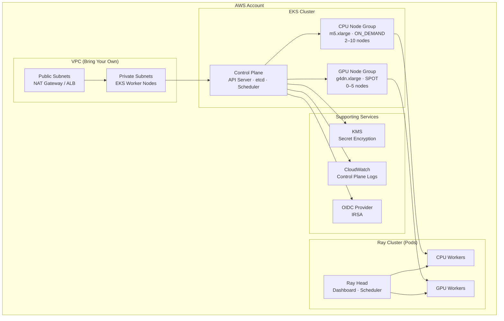
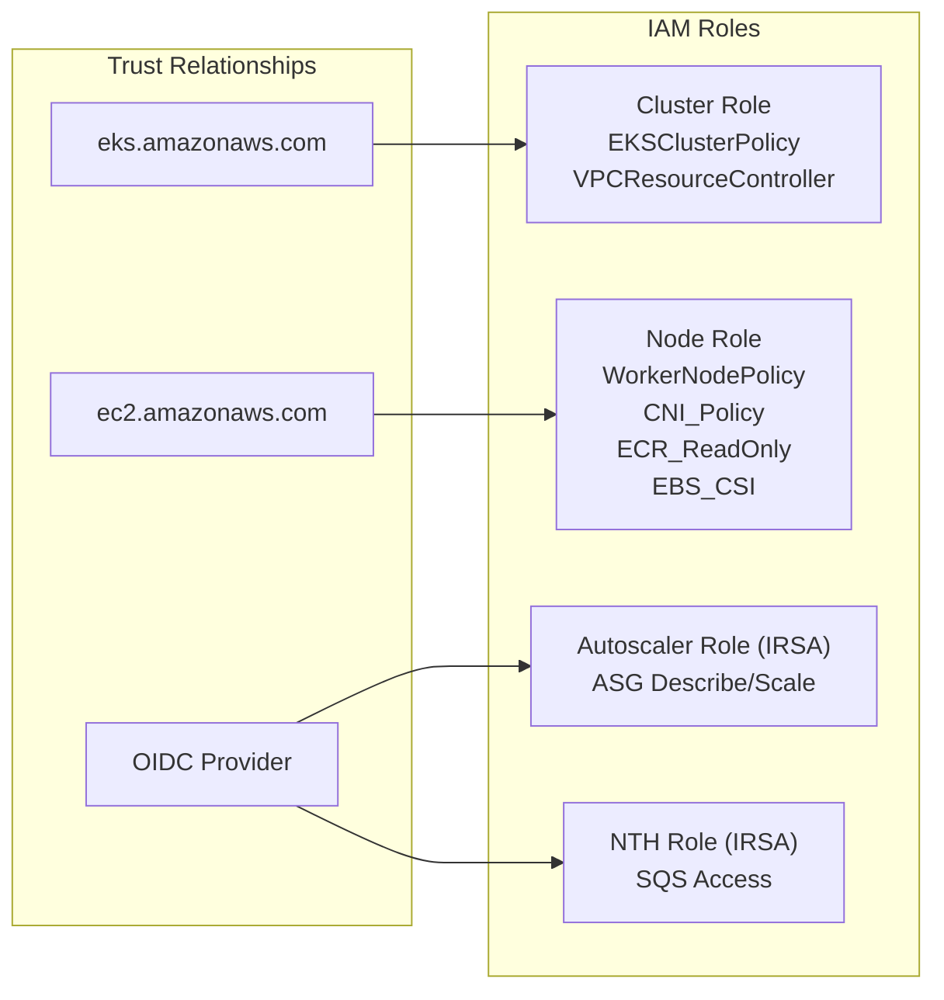

# Infrastructure Architecture

This document provides a deep technical reference for the AWS infrastructure provisioned by this Terraform module.

## High-Level Overview

The module provisions a complete EKS-based platform for running Ray ML workloads on AWS. The resource graph flows from foundational networking and IAM through the EKS control plane, into managed node groups, and finally the Ray application layer.



## Resource Inventory

The module creates the following AWS resources (defined across `terraform/main.tf` and `terraform/node_pools.tf`):

| Resource | Type | Purpose |
|----------|------|---------|
| `aws_eks_cluster.main` | EKS Cluster | Kubernetes control plane |
| `aws_eks_node_group.cpu_workers` | Managed Node Group | CPU worker pool (ON_DEMAND) |
| `aws_eks_node_group.gpu_workers` | Managed Node Group | GPU worker pool (SPOT, conditional) |
| `aws_launch_template.cpu_workers` | Launch Template | CPU node EBS, IMDSv2, user-data |
| `aws_launch_template.gpu_workers` | Launch Template | GPU node EBS, NVIDIA drivers |
| `aws_security_group.node` | Security Group | Node-to-node communication |
| `aws_iam_role.cluster` | IAM Role | EKS control plane service role |
| `aws_iam_role.node` | IAM Role | EC2 worker node role |
| `aws_iam_role.cluster_autoscaler` | IAM Role (IRSA) | Cluster Autoscaler pod identity |
| `aws_iam_role.node_termination_handler` | IAM Role (IRSA) | Spot interruption handler |
| `aws_iam_openid_connect_provider.cluster` | OIDC Provider | Enables IRSA for pod-level IAM |
| `aws_kms_key.eks` | KMS Key | Envelope encryption of K8s secrets |
| `aws_cloudwatch_log_group.cluster` | CloudWatch Log Group | API, audit, authenticator, scheduler logs |
| `aws_eks_addon.addons` | EKS Addons | vpc-cni, kube-proxy, coredns |

## VPC Topology

This module follows a **bring-your-own-VPC** pattern. The consumer provides `vpc_id` and `subnet_ids`. The recommended topology is:

```
VPC (e.g., 10.0.0.0/16)
├── Public Subnets (3 AZs)
│   ├── NAT Gateway
│   └── Application Load Balancer (if needed)
├── Private Subnets (3 AZs)
│   ├── EKS Worker Nodes
│   └── Ray Pods
└── Route Tables
    ├── Public → Internet Gateway
    └── Private → NAT Gateway
```

The complete example in `terraform/examples/complete/main.tf` provisions a VPC using the `terraform-aws-modules/vpc/aws` community module with 3-AZ private/public subnet layout.

## IAM Architecture



- **Cluster Role** — assumed by the EKS control plane. Policies: `AmazonEKSClusterPolicy`, `AmazonEKSVPCResourceController`.
- **Node Role** — assumed by EC2 worker instances. Policies: `AmazonEKSWorkerNodePolicy`, `AmazonEKS_CNI_Policy`, `AmazonEC2ContainerRegistryReadOnly`, plus a custom EBS CSI policy.
- **Cluster Autoscaler Role** — IRSA-based. Bound to `kube-system:cluster-autoscaler` service account. Grants `autoscaling:Describe*`, `autoscaling:SetDesiredCapacity`, `autoscaling:TerminateInstanceInAutoScalingGroup`.
- **Node Termination Handler Role** — IRSA-based. Provisioned only when GPU nodes use SPOT capacity. Grants `AmazonSQSFullAccess` for reading ASG termination events.

## KMS Encryption

Kubernetes secrets are encrypted at rest using AWS KMS envelope encryption:

1. If `var.kms_key_arn` is provided, that key is used.
2. Otherwise, the module creates a dedicated CMK (`aws_kms_key.eks`) with:
   - Automatic annual key rotation enabled
   - 7-day deletion window
   - Key policy granting decrypt/encrypt to the EKS cluster IAM role

The same KMS key is used for CloudWatch log group encryption.

## Node Group Design

### CPU Workers
- **Capacity Type**: `ON_DEMAND` (default)
- **Instance Types**: `m5.xlarge`, `m5.2xlarge`
- **Scaling**: 2 (min) → 3 (desired) → 10 (max)
- **Labels**: `ray.io/node-type=worker`, `ray.io/resource-type=cpu`
- **EBS**: 100 GiB gp3, encrypted, 3000 IOPS

### GPU Workers (Conditional)
- **Capacity Type**: `SPOT` (default, for cost optimization)
- **Instance Types**: `g4dn.xlarge`, `g4dn.2xlarge`
- **Scaling**: 0 (min) → 0 (desired) → 5 (max) — scale-to-zero
- **Taint**: `nvidia.com/gpu=true:NoSchedule` — prevents non-GPU workloads
- **Labels**: `ray.io/resource-type=gpu`, `nvidia.com/gpu=true`
- **EBS**: 200 GiB gp3, encrypted, 3000 IOPS
- **User Data**: Installs NVIDIA drivers and container runtime via `terraform/user-data-gpu.sh`

Both node groups use:
- `create_before_destroy` lifecycle for zero-downtime updates
- `ignore_changes` on `desired_size` to prevent Terraform from fighting the autoscaler
- IMDSv2 enforcement (`http_tokens = required`)

## EKS Addons

| Addon | Purpose |
|-------|---------|
| `vpc-cni` | Pod networking via AWS VPC CNI |
| `kube-proxy` | Kubernetes service proxy |
| `coredns` | Cluster DNS |

All addons use `OVERWRITE` conflict resolution and depend on the CPU node group being ready.

## Network Security

- **Egress**: Node SG allows outbound to RFC 1918 ranges (`10.0.0.0/8`, `172.16.0.0/12`, `192.168.0.0/16`)
- **Ingress**: Self-referencing rule allows all node-to-node traffic (required for Ray GCS and object store)
- **Cluster Endpoint**: Private access enabled by default, public access disabled (`cluster_endpoint_public_access = false`)

## CloudWatch Logging

When `enable_cloudwatch_logs = true` (default), the following control plane log types are shipped:
- `api` — API server audit trail
- `audit` — Kubernetes audit logs
- `authenticator` — IAM authenticator events
- `controllerManager` — Controller actions
- `scheduler` — Scheduling decisions

Retention: 7 days (configurable via `log_retention_days`).
