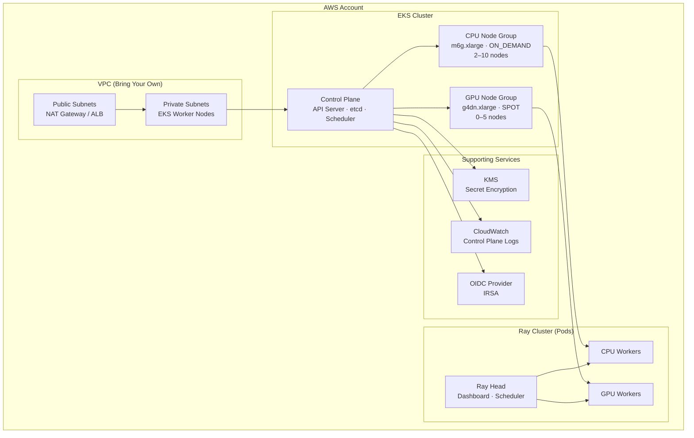
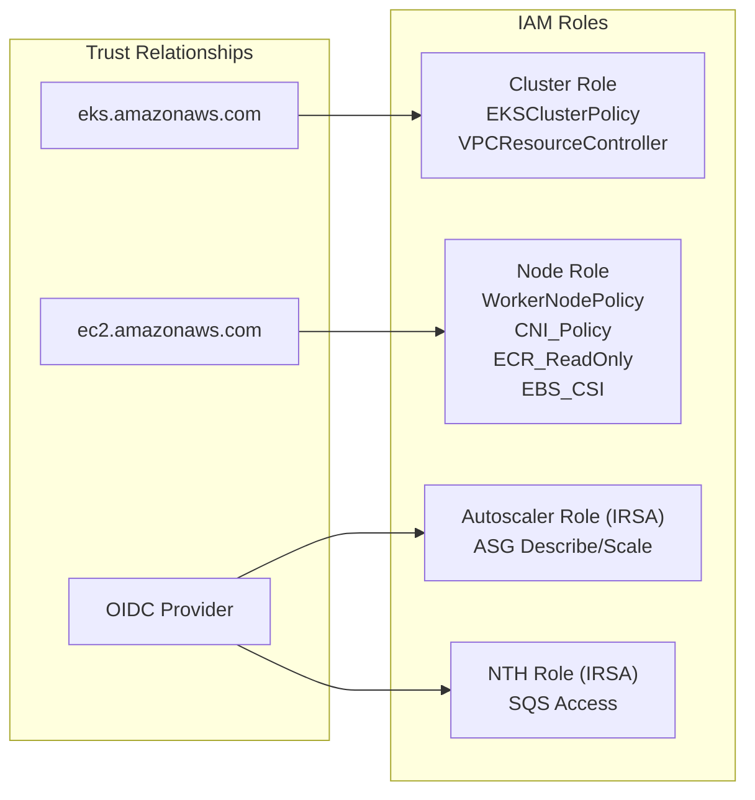

# Infrastructure Architecture

This document provides a deep technical reference for the AWS infrastructure provisioned by this Terraform module.

## High-Level Overview

The module provisions a complete EKS-based platform for running Ray ML workloads on AWS. The resource graph flows from foundational networking and IAM through the EKS control plane, into managed node groups, and finally the Ray application layer.


```mermaid
graph TB
    subgraph "AWS Account"
        subgraph "VPC (Bring Your Own)"
            PUB["Public Subnets<br/>NAT Gateway / ALB"]
            PRIV["Private Subnets<br/>EKS Worker Nodes"]
        end

        subgraph "EKS Cluster"
            CP["Control Plane<br/>API Server · etcd · Scheduler"]
            CPU_NG["CPU Node Group<br/>m6g.xlarge · ON_DEMAND<br/>2–10 nodes"]
            GPU_NG["GPU Node Group<br/>g4dn.xlarge · SPOT<br/>0–5 nodes"]
        end

        subgraph "Supporting Services"
            KMS["KMS<br/>Secret Encryption"]
            CW["CloudWatch<br/>Control Plane Logs"]
            OIDC["OIDC Provider<br/>IRSA"]
        end

        subgraph "Ray Cluster (Pods)"
            HEAD["Ray Head<br/>Dashboard · Scheduler"]
            WCPU["CPU Workers"]
            WGPU["GPU Workers"]
        end
    end

    PUB --> PRIV
    PRIV --> CP
    CP --> CPU_NG
    CP --> GPU_NG
    CPU_NG --> WCPU
    GPU_NG --> WGPU
    HEAD --> WCPU
    HEAD --> WGPU
    CP --> KMS
    CP --> CW
    CP --> OIDC
```

## Resource Inventory

The module creates the following AWS resources (defined across `terraform/main.tf` and `terraform/node_pools.tf`):

| Resource | Type | Purpose |
|----------|------|-------|
| `aws_eks_cluster.main` | EKS Cluster | Kubernetes control plane |
| `aws_eks_node_group.cpu_workers` | Managed Node Group | CPU worker pool (ON_DEMAND) |
| `aws_eks_node_group.gpu_workers` | Managed Node Group | GPU worker pool (SPOT, conditional) |
| `aws_launch_template.cpu_workers` | Launch Template | CPU node EBS, IMDSv2, user-data |
| `aws_launch_template.gpu_workers` | Launch Template | GPU node EBS, NVIDIA drivers |
| `aws_security_group.node` | Security Group | Node-to-node communication |
| `aws_iam_role.cluster` | IAM Role | EKS control plane service role |
| `aws_iam_role.node` | IAM Role | EC2 worker node role |
| `aws_iam_role.cluster_autoscaler` | IAM Role (IRSA) | Cluster Autoscaler pod identity |
| `aws_iam_role.node_termination_handler` | IAM Role (IRSA) | Spot interruption handler |
| `aws_iam_openid_connect_provider.cluster` | OIDC Provider | Enables IRSA for pod-level IAM |
| `aws_kms_key.eks` | KMS Key | Envelope encryption of K8s secrets |
| `aws_cloudwatch_log_group.cluster` | CloudWatch Log Group | API, audit, authenticator, scheduler logs |
| `aws_eks_addon.addons` | EKS Addons | vpc-cni, kube-proxy, coredns |

## VPC Topology

This module follows a **bring-your-own-VPC** pattern. The consumer provides `vpc_id` and `subnet_ids`. The recommended topology is:

```
VPC (e.g., 10.0.0.0/16)
├── Public Subnets (3 AZs)
│   ├── NAT Gateway
│   └── Application Load Balancer (if needed)
├── Private Subnets (3 AZs)
│   ├── EKS Worker Nodes
│   └── Ray Pods
└── Route Tables
    ├── Public → Internet Gateway
    └── Private → NAT Gateway
```

The complete example in `terraform/examples/complete/main.tf` provisions a VPC using the `terraform-aws-modules/vpc/aws` community module with 3-AZ private/public subnet layout.

## IAM Architecture


```mermaid
graph LR
    subgraph "IAM Roles"
        CR["Cluster Role<br/>EKSClusterPolicy<br/>VPCResourceController"]
        NR["Node Role<br/>WorkerNodePolicy<br/>CNI_Policy<br/>ECR_ReadOnly<br/>EBS_CSI"]
        ASR["Autoscaler Role (IRSA)<br/>ASG Describe/Scale"]
        NTH["NTH Role (IRSA)<br/>SQS Access"]
    end

    subgraph "Trust Relationships"
        EKS["eks.amazonaws.com"] --> CR
        EC2["ec2.amazonaws.com"] --> NR
        OIDC["OIDC Provider"] --> ASR
        OIDC --> NTH
    end
```

- **Cluster Role** — assumed by the EKS control plane; grants AWS APIs needed to manage ENIs, security groups, and load balancers.
- **Node Role** — assumed by every EC2 worker; grants ECR pull, VPC CNI mutation, and EBS CSI attachment.
- **Autoscaler Role (IRSA)** — scoped to the `kube-system/cluster-autoscaler` service account; allows `autoscaling:Describe*` and `autoscaling:SetDesiredCapacity`.
- **NTH Role (IRSA)** — scoped to the node termination handler; allows reading the SQS queue for Spot interruption notices.

## Node Group Design

### CPU Node Group

| Parameter | Value |
|-----------|-------|
| Instance type | `m6g.xlarge` (4 vCPU, 16 GiB) |
| Architecture | ARM64 (AWS Graviton2) |
| Capacity type | `ON_DEMAND` |
| Scaling | min=2, desired=2, max=10 |
| Storage | 50 GiB gp3 EBS |
| AMI | `AL2_ARM_64` |

The CPU node group uses `m6g.xlarge` Graviton2 instances for cost-efficient general-purpose workloads. The `m6g` family provides up to 40% better price/performance than equivalent `m5` instances.

### GPU Node Group

| Parameter | Value |
|-----------|-------|
| Instance type | `g4dn.xlarge` (4 vCPU, 16 GiB, 1x T4 GPU) |
| Architecture | x86_64 |
| Capacity type | `SPOT` |
| Scaling | min=0, desired=0, max=5 |
| Storage | 100 GiB gp3 EBS |
| AMI | `AL2_x86_64_GPU` |

The GPU node group scales to zero by default and is only enabled when `enable_gpu_nodes = true`. Spot capacity reduces GPU costs by up to 70%.

## Security Architecture

### Network Security

- Worker nodes live in **private subnets** with no direct internet ingress.
- A dedicated **node security group** allows:
  - All traffic within the node SG (node-to-node).
  - Port 443 inbound from the EKS control plane SG (kubelet/webhook).
  - Ephemeral ports (1025–65535) inbound from the control plane SG.
- IMDSv2 is **enforced** on all nodes via launch template (`http_tokens = required`, hop limit = 1).

### Secrets Encryption

A dedicated **KMS Customer Managed Key** (CMK) is created for envelope encryption of Kubernetes `Secret` objects stored in etcd. Key rotation is enabled by default.

### IRSA (IAM Roles for Service Accounts)

An OIDC provider is registered for the EKS cluster, enabling pods to assume IAM roles without node-level credentials. The Cluster Autoscaler and Node Termination Handler both use IRSA.

## Add-ons

| Add-on | Purpose |
|--------|---------|
| `vpc-cni` | AWS VPC CNI — assigns VPC IPs to pods |
| `kube-proxy` | iptables rules for Service routing |
| `coredns` | In-cluster DNS resolution |

Add-on versions are pinned via the `addon_versions` variable and can be upgraded independently of the cluster version.

## Observability

Control plane log types enabled by default:

- `api` — API server request logs
- `audit` — Kubernetes audit log
- `authenticator` — AWS IAM authenticator logs
- `controllerManager` — kube-controller-manager logs
- `scheduler` — kube-scheduler logs

Logs are shipped to a **CloudWatch Log Group** (`/aws/eks/<cluster-name>/cluster`) with a configurable retention period (default: 30 days).
