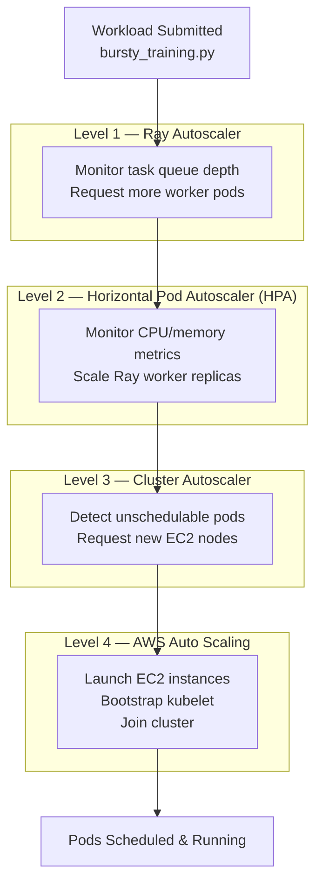

# Multi-Level Autoscaling

This document explains how four autoscaling layers coordinate to deliver cost-optimized, elastic compute for bursty Ray ML workloads.

## Autoscaling Stack



---

## Level 1: Ray Autoscaler

The Ray autoscaler runs inside the Ray head pod and adjusts the desired worker count based on task queue depth.

| Parameter | Value |
|-----------|-------|
| Idle timeout | 60 seconds |
| Max workers | 15 |
| Upscaling speed | 1.0 |

**Defined in**: `helm/ray/values.yaml` → `autoscaler` and `rayConfig` sections.

---

## Level 2: Horizontal Pod Autoscaler (HPA)

The HPA scales Ray worker pod replicas based on CPU and memory utilization metrics from the Metrics Server.

### CPU Workers HPA

| Parameter | Value |
|-----------|-------|
| Min replicas | 2 |
| Max replicas | 10 |
| Target CPU | 70% |
| Target memory | 80% |
| Scale-up stabilization | 0s (immediate) |
| Scale-up policy | +100% or +2 pods per 30s |
| Scale-down stabilization | 300s |
| Scale-down policy | -50% per 60s |

### GPU Workers HPA

| Parameter | Value |
|-----------|-------|
| Min replicas | 0 (scale-to-zero) |
| Max replicas | 5 |
| Target CPU | 60% |
| Scale-up policy | +1 pod per 60s |
| Scale-down stabilization | 600s |
| Scale-down policy | -1 pod per 120s |

**Design decisions**:
- GPU scale-down is intentionally slow (10-minute stabilization) because GPU node provisioning takes 3-5 minutes. Premature scale-down causes thrashing.
- CPU scale-up is aggressive (0s stabilization) because CPU nodes are cheaper and faster to provision.

---

## Level 3: Cluster Autoscaler

The Kubernetes Cluster Autoscaler monitors for unschedulable pods and requests new EC2 instances from the node group's Auto Scaling Group.

| Parameter | Value |
|-----------|-------|
| CPU node group | min: 2, max: 10 |
| GPU node group | min: 0, max: 5 |
| Unschedulable detection | Immediate |
| Scale-down threshold | Node < 50% utilized for 10 minutes |
| Scale-down behavior | 1 node at a time, respects PDBs |

**IRSA configuration**: The Cluster Autoscaler pod uses `kube-system:cluster-autoscaler` service account annotated with the IRSA role ARN from the module output `cluster_autoscaler_iam_role_arn`.

**Deployment**: Installed via Helm in `examples/complete/helm.tf`:
```hcl
resource "helm_release" "cluster_autoscaler" {
  name       = "cluster-autoscaler"
  chart      = "cluster-autoscaler"
  repository = "https://kubernetes.github.io/autoscaler"
  namespace  = "kube-system"
}
```

---

## Level 4: AWS Auto Scaling

When the Cluster Autoscaler requests capacity, AWS launches new EC2 instances from the launch template.

**Launch process**:
1. Select AZ with fewest instances (balance)
2. Launch from the node's launch template
3. Bootstrap kubelet via `user-data.sh` / `user-data-gpu.sh`
4. Join cluster, mark node `Ready`

**Duration**: 3–5 minutes.

---

## Timing Characteristics

### Scale-Up Path

| Event | Layer | Typical Duration |
|-------|-------|-----------------|
| Task submitted | Ray | Immediate |
| Request more workers | Ray Autoscaler | 5–10 seconds |
| HPA scales pods | Kubernetes | 30–60 seconds |
| Node needed (detected) | Cluster Autoscaler | Immediate |
| EC2 launched | AWS | 3–5 minutes |
| Node ready | Kubernetes | 30–60 seconds |
| **Total** | | **4–7 minutes** |

### Scale-Down Path

| Event | Layer | Typical Duration |
|-------|-------|-----------------|
| Workload idle | Ray | 60 seconds |
| HPA scales down | Kubernetes | 5 minutes (stabilization) |
| Node underutilized | Cluster Autoscaler | 10 minutes |
| Node terminated | AWS | 2–3 minutes |
| **Total** | | **15–20 minutes** |

---

## GPU Scale-to-Zero

GPU nodes default to `min_size = 0` and `desired_size = 0`. This means:

- **No GPU cost** when no GPU workloads are running
- GPU nodes spin up only when a pod with `nvidia.com/gpu` resource request is pending
- The taint `nvidia.com/gpu=true:NoSchedule` prevents non-GPU pods from triggering GPU node provisioning

---

## Spot Instance Fault Tolerance

GPU nodes default to `SPOT` capacity type. Ray's built-in fault tolerance handles Spot interruptions:

1. **AWS Node Termination Handler** (via IRSA role) reads SQS events for Spot interruption notices
2. Worker pods are gracefully drained
3. The Cluster Autoscaler replaces terminated nodes
4. Ray re-schedules tasks from the object store

---

## Bursty Training Workload

The `workloads/bursty_training.py` script demonstrates the full autoscaling pipeline with a deterministic 6-phase burst pattern:

| Phase | Workers | Duration | Matrix Size | Purpose |
|-------|---------|----------|-------------|---------|
| 1. Warm-up | 2 | 10s | 500×500 | Establish baseline |
| 2. Small burst | 5 | 15s | 700×700 | Gentle scale-up |
| 3. Peak burst | 10 | 20s | 1000×1000 | Max scale-up trigger |
| 4. Sustained load | 8 | 15s | 800×800 | Hold capacity |
| 5. Gradual decrease | 4 | 10s | 600×600 | Begin scale-down |
| 6. Cooldown | 2 | 5s | 400×400 | Return to baseline |

The workload exports structured JSON metrics to `/tmp/workload-metrics.json` for analysis.

---

## Tuning Recommendations

| Goal | Adjustment |
|------|------------|
| Faster scale-up | Decrease HPA `stabilizationWindowSeconds` for scale-up |
| Reduce cost | Increase scale-down stabilization, lower `max_size` |
| Prevent thrashing | Increase GPU scale-down stabilization beyond 600s |
| Higher throughput | Increase `cpu_node_max_size` and `maxReplicas` |
| GPU cost control | Keep `gpu_node_min_size = 0`, use SPOT capacity |
