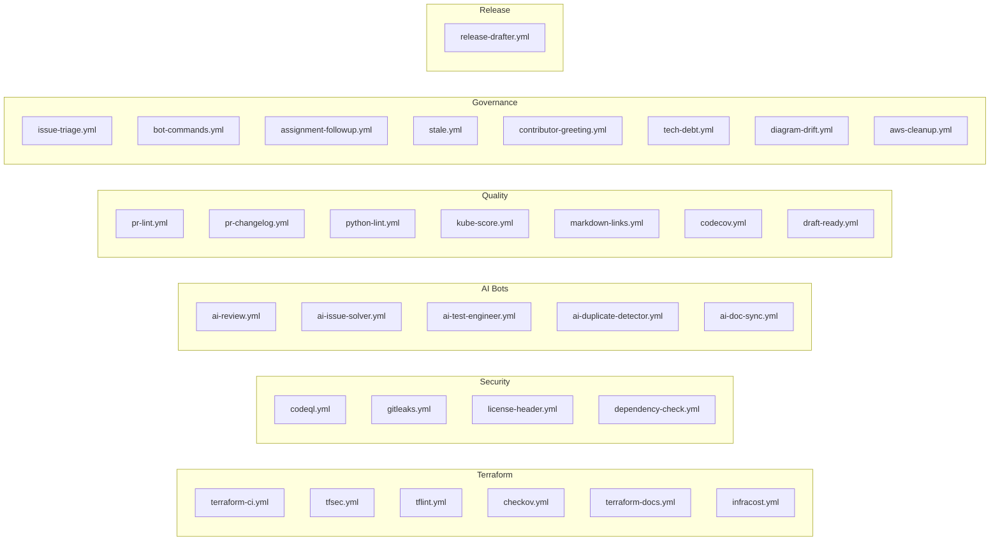

# CI/CD Pipeline Catalog

This repository uses **31 GitHub Action workflows** organized into six categories. All workflows are defined in `.github/workflows/`.

## Workflow Categories

---

## Terraform Workflows

| Workflow | Trigger | Description |
|----------|---------|-------------|
| `terraform-ci.yml` | PR, push to main | `terraform init`, `validate`, `fmt -check` |
| `tfsec.yml` | PR | Static security analysis of Terraform code |
| `tflint.yml` | PR | Terraform linting with `.tflint.hcl` config |
| `checkov.yml` | PR | Infrastructure-as-Code policy scanning |
| `terraform-docs.yml` | PR | Auto-generates terraform-docs in README |
| `infracost.yml` | PR | Cost estimation for infrastructure changes |

---

## Security Workflows

| Workflow | Trigger | Description |
|----------|---------|-------------|
| `codeql.yml` | PR, push, schedule | GitHub CodeQL semantic analysis |
| `gitleaks.yml` | PR, push | Secret leak detection in commits |
| `license-header.yml` | PR | Validates license headers in source files |
| `dependency-check.yml` | PR, schedule | Dependency vulnerability scanning |

---

## AI Bot Workflows

| Workflow | Trigger | Description |
|----------|---------|-------------|
| `ai-review.yml` | PR opened/synchronize | Gemini-powered code review |
| `ai-issue-solver.yml` | Issue opened, `/plan` command | AI solution planning for issues |
| `ai-test-engineer.yml` | PR opened/synchronize | AI-generated test suggestions |
| `ai-duplicate-detector.yml` | Issue opened | Duplicate issue detection |
| `ai-doc-sync.yml` | PR opened/updated | Documentation sync and validation |

---

## Quality Workflows

| Workflow | Trigger | Description |
|----------|---------|-------------|
| `pr-lint.yml` | PR | Validates PR title follows conventional commits |
| `pr-changelog.yml` | PR | Ensures changelog entry included |
| `python-lint.yml` | PR | Python linting (flake8/ruff) for scripts |
| `kube-score.yml` | PR | Kubernetes manifest scoring |
| `markdown-links.yml` | PR, push | Validates markdown links not broken |
| `codecov.yml` | PR, push | Code coverage reporting |
| `draft-ready.yml` | PR ready for review | Marks draft PRs ready |

---

## Governance Workflows

| Workflow | Trigger | Description |
|----------|---------|-------------|
| `issue-triage.yml` | Issue opened | Auto-labels and triages new issues |
| `bot-commands.yml` | Issue/PR comment | Slash command handler (`/plan`, `/replan`, `/working`, etc.) |
| `assignment-followup.yml` | Schedule, issue comment | Follows up on assigned issues with `/working`, `/blocked`, `/eta` |
| `stale.yml` | Schedule | Marks and closes stale issues/PRs |
| `contributor-greeting.yml` | PR opened, issue opened | Welcomes first-time contributors |
| `tech-debt.yml` | Schedule, manual | Tracks and reports technical debt |
| `diagram-drift.yml` | PR, push | Detects when diagrams are out of sync with code |
| `aws-cleanup.yml` | Manual | Safely destroys AWS resources |

---

## Release Workflows

| Workflow | Trigger | Description |
|----------|---------|-------------|
| `release-drafter.yml` | PR merged to main | Auto-drafts release notes |

---

## Required Secrets

| Secret | Used By | Description |
|--------|---------|-------------|
| `GEMINI_API_KEY` | AI bots | Google Gemini API key |
| `AWS_ROLE_ARN` | Terraform workflows | AWS IAM role for OIDC |
| `INFRACOST_API_KEY` | `infracost.yml` | Infracost cloud API key |

The `GITHUB_TOKEN` is automatically provided by GitHub Actions and does not need manual configuration.

## CI Gate Policy

All PRs must pass the following gates before merge:
1. `terraform-ci.yml` — Format, validate, init
2. `tfsec.yml` — No critical security findings
3. `tflint.yml` — No lint errors
4. `checkov.yml` — No policy violations
5. `python-lint.yml` — Clean Python linting
6. `pr-lint.yml` — Conventional commit title
