# Security Architecture

This document covers the security controls implemented across the infrastructure, CI/CD pipeline, and application layers.

## Defense-in-Depth Model

```mermaid
graph TB
    subgraph "Layer 1: Identity & Access"
        GA["GitHub App<br/>Short-lived tokens"]
        OIDC["AWS OIDC Federation<br/>No static credentials"]
        IRSA["IRSA<br/>Pod-level IAM"]
    end

    subgraph "Layer 2: Network"
        VPC["Private Subnets"]
        SG["Security Groups<br/>Least-privilege egress"]
        EP["Private EKS Endpoint"]
    end

    subgraph "Layer 3: Encryption"
        KMS["KMS Envelope Encryption<br/>Kubernetes secrets"]
        EBS["EBS Volume Encryption"]
        TLS["TLS in Transit"]
    end

    subgraph "Layer 4: Governance"
        OPA["OPA Policies<br/>Terraform + Ray"]
        TFSEC["tfsec / Checkov<br/>Static analysis"]
        GL["Gitleaks<br/>Secret scanning"]
    end

    subgraph "Layer 5: Instance"
        IMDS["IMDSv2 Required"]
        TAINT["GPU Node Taints"]
        SEC["Pod Security Context<br/>Non-root, fsGroup"]
    end

    GA --> OIDC --> IRSA
    VPC --> SG --> EP
    KMS --> EBS --> TLS
    OPA --> TFSEC --> GL
    IMDS --> TAINT --> SEC
```



---

## GitHub App Authentication

The project uses GitHub App Installation Tokens instead of Personal Access Tokens (PATs).

| Property | GitHub App | PAT |
|----------|-----------|-----|
| Lifetime | 1 hour (auto-expire) | Until manually revoked |
| Scope | Granular per-permission | User's full access |
| Audit | App-specific trail | User-attributed |
| Rotation | Automatic per workflow | Manual |
| Revocation | Uninstall app | Delete token |

**Flow**:
1. Generate JWT signed with RSA private key (10-minute expiry)
2. Exchange JWT for Installation Token via GitHub API (1-hour expiry)
3. Use Installation Token for git ops, API calls, and OIDC cloud auth

**Required secrets** (stored as GitHub Secrets):
- `APP_ID` — Numeric app ID
- `APP_PRIVATE_KEY` — RSA PEM private key
- `INSTALLATION_ID` — Organization installation ID

Full flow documented in [`.github/app/auth-flow.md`](../.github/app/auth-flow.md).
Permissions breakdown in [`.github/app/permissions.md`](../.github/app/permissions.md).

---

## AWS OIDC Federation

No AWS access keys are stored in GitHub. Instead:

1. GitHub Actions obtains an OIDC token from GitHub's identity provider
2. The token is exchanged for temporary AWS credentials via `aws-actions/configure-aws-credentials`
3. The IAM role trust policy restricts access to the specific repository

```yaml
# Example trust policy condition
"Condition": {
  "StringEquals": {
    "token.actions.githubusercontent.com:aud": "sts.amazonaws.com"
  },
  "StringLike": {
    "token.actions.githubusercontent.com:sub": "repo:ambicuity/Terraform-Driven-Ray-on-Kubernetes-Platform:*"
  }
}
```

---

## IAM Roles for Service Accounts (IRSA)

Pods authenticate to AWS services using Kubernetes service accounts bound to IAM roles via the OIDC provider.

| Service Account | IAM Role | Permissions |
|----------------|----------|-------------|
| `cluster-autoscaler` | `{cluster}-autoscaler-*` | ASG describe, scale, terminate |
| `aws-node-termination-handler` | `{cluster}-nth-*` | SQS full access (Spot events) |

The OIDC provider is created by the module (`aws_iam_openid_connect_provider.cluster`) with the EKS cluster's issuer URL.

---

## KMS Envelope Encryption

Kubernetes secrets are encrypted at rest:

- **Key type**: AES-256 via AWS KMS CMK
- **Key rotation**: Automatic annual rotation enabled
- **Deletion protection**: 7-day deletion window
- **Key policy**: Root account + EKS cluster role only

If no `kms_key_arn` is provided, the module creates a dedicated CMK.

CloudWatch log groups use the same KMS key for encryption.

---

## IMDSv2 Enforcement

Both CPU and GPU launch templates enforce IMDSv2:

```hcl
metadata_options {
  http_endpoint               = "enabled"
  http_tokens                 = "required"    # IMDSv2 only
  http_put_response_hop_limit = 1             # Block container SSRF
}
```

This prevents SSRF-based credential theft from the EC2 metadata service.

---

## Node Isolation

### GPU Node Taints

GPU nodes are tainted to prevent non-GPU workloads from consuming expensive resources:

```yaml
taint:
  key: nvidia.com/gpu
  value: "true"
  effect: NoSchedule
```

Only pods with a matching toleration (e.g., Ray GPU workers) are scheduled to GPU nodes.

### Security Groups

- **Egress**: Limited to RFC 1918 private ranges (10.0.0.0/8, 172.16.0.0/12, 192.168.0.0/16)
- **Ingress**: Self-referencing rule for node-to-node communication only
- **No public ingress** by default

### Cluster Endpoint

- Private endpoint access: **enabled** (always)
- Public endpoint access: **disabled** (default, configurable)

---

## OPA Policy Enforcement

Two Rego policy files provide governance guardrails:

### Terraform Policy (`policies/terraform.rego`)

| Rule | Description |
|------|-------------|
| Region restriction | Only `us-east-1`, `us-east-2`, `us-west-2`, `eu-west-1` |
| CPU node cap | Max 20 nodes per group |
| GPU node cap | Max 10 nodes |
| Instance type allowlist | Specific m5/t3 (CPU) and g4dn/p3 (GPU) types |
| EBS encryption | Must be encrypted |
| Required tags | `ManagedBy`, `Environment`, `Repository` |
| Private endpoint | Required when public access enabled |
| CloudWatch logging | Must be enabled |
| IMDSv2 | `http_tokens = required` |
| Storage cap | Max 500 GiB per volume |
| Autoscaling | `min_size` must differ from `max_size` |

### Ray Policy (`policies/ray.rego`)

| Rule | Description |
|------|-------------|
| CPU per worker | Max 16 |
| Memory per worker | Max 64 GiB |
| GPU per worker | Max 4 |
| Total workers | Max 50 |
| Total GPUs | Max 20 |
| Min CPU request | 0.5 |
| Min memory request | 0.5 GiB |
| GPU toleration | Required for GPU workers |
| Required labels | `ray.io/node-type`, `app` |

---

## CI Security Gates

Every PR is automatically scanned by:

| Tool | Workflow | Coverage |
|------|----------|----------|
| **tfsec** | `tfsec.yml` | Terraform security analysis |
| **Checkov** | `checkov.yml` | IaC policy scanning |
| **CodeQL** | `codeql.yml` | Semantic code analysis |
| **Gitleaks** | `gitleaks.yml` | Secret detection |
| **Dependency Check** | `dependency-check.yml` | Vulnerability scanning |
| **License Header** | `license-header.yml` | License compliance |

---

## Pod Security

The Ray Helm chart enforces a restrictive security context:

```yaml
securityContext:
  runAsUser: 1000
  runAsGroup: 1000
  fsGroup: 1000
  runAsNonRoot: true
```

No pods run as root. File ownership is set to a non-privileged user.

---

## Compliance Mapping

| Framework | Controls Addressed |
|-----------|-------------------|
| **SOC 2 Type II** | Encryption at rest, audit logging, access controls, change management |
| **CIS Benchmarks** | IMDSv2, private endpoints, least-privilege IAM, encryption |
| **NIST CSF** | Identity (OIDC), Protection (KMS, SG), Detection (CloudWatch, CodeQL) |
